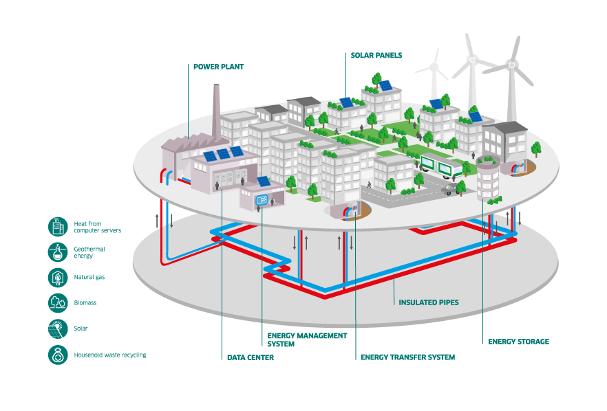
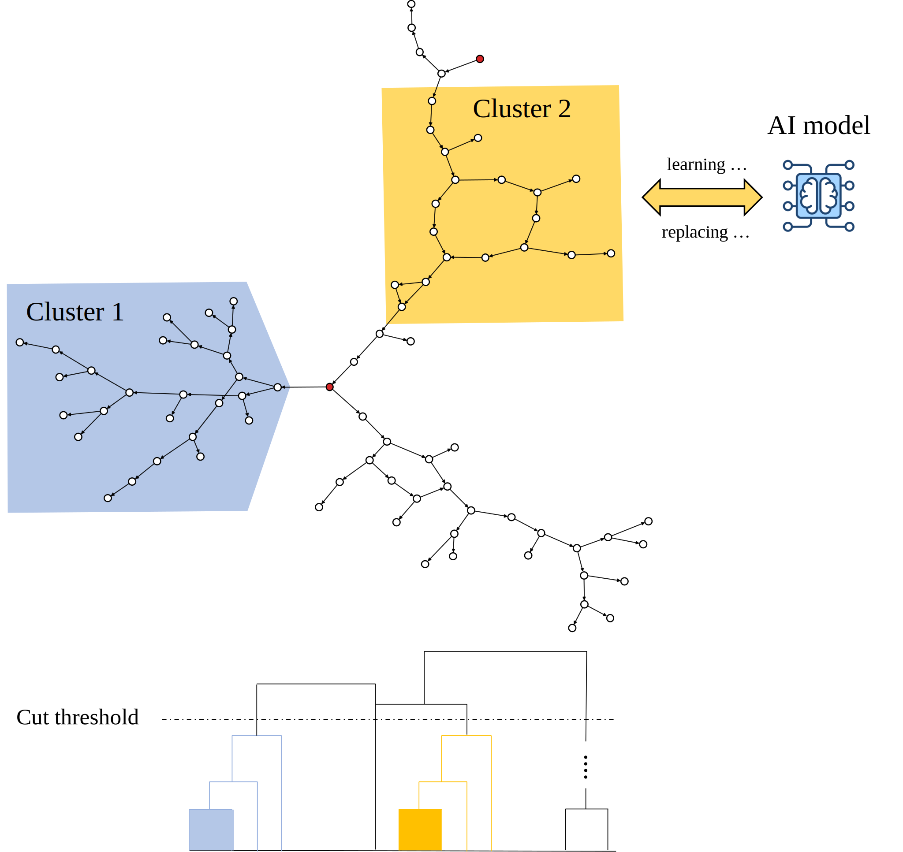

District Heating Networks (DHNs) are flexibile and efficient heat delivery systems. Through the last decades, these systems have gained popular interests from European contries. DHNs provide low cost solutions to incorporate renewable sources in heat production and contributing to CO2 reductions inline with the EU [2050 climat-neutral objective](https://climate.ec.europa.eu/eu-action/climate-strategies-targets/2050-long-term-strategy_en). 



# Objective

Major problematic faced by DHNs operators come from the high computational costs of modeling these systems. The main reason is that these networks are spatially sparse. Therefore, a reduction of such sparsity is the straightforward solution to this problem. 


In our **paper**, we propose an unsupervised clustering-based approach to identify `similar' substation nodes which are replaced by trained *AI models*. A task-driven distance metric has been introduced to quantify such **similarty**.





# Repository 

This repository contains the obtained results presented in our paper, the data used and the codes to reproduced our results.


## Case study DHNs

17 DHNs have been studied in this work. The topology files and visualisation figures can be found in [the studied DHNs folder](studied_dhns/). Substation nodes are represented by circles, red-filled for heat sources and white-filled for heat consumers. The edges represent the pair of pipes (supply and return) which directions follow the supply pipes directions. Edges are colored in black. However, we indicate in red dashed the edges which pipes have flux inversions. 


## Packages installation

To install all required packages, enter the following line commands at the project source folder

```bash
python -m pip install -r requirements.txt
``` 


## Codes sources

All code sources can be found in [the source folder](src/). An example of performing the clustering is proposed in the proposed example.ipynb which presents in great details how to perform the clustering. We recall to the readers that the physical simulation states data of the DHNs are not available in this repository due to their memory sizes. However, they can be made available at request. 

We provide an illustration example in the notebook [example](example.ipynb). This illustration uses the DHN with indicator 1.


## Contributions

We welcome all comments and improvements contributions. Please contact us or submit an issue.


# License

Data and codes in this project are protected under the [European Union Public Licence (EUPL) v1.2](https://joinup.ec.europa.eu/page/eupl-text-11-12).
For more information see [LICENSE](LICENSE).